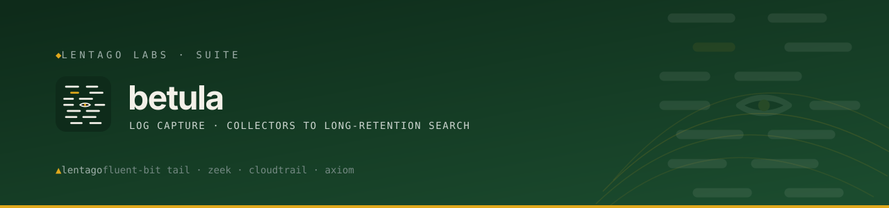
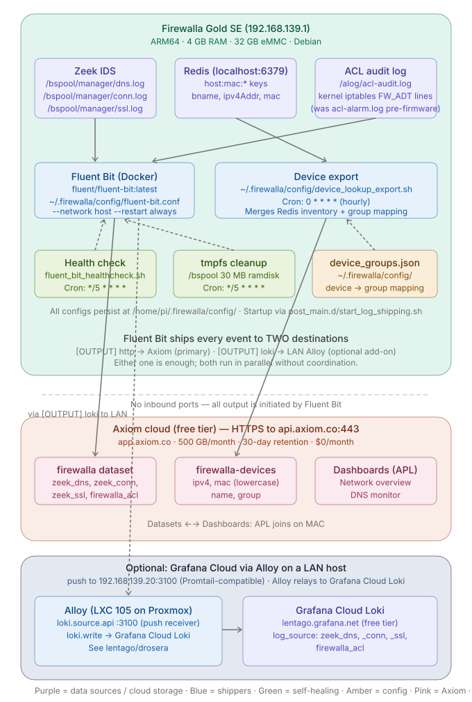

<!-- Lentago Labs brand header — generated by lentago/.github → brand/generate.py.
     Regenerate there; do not hand-edit the banner or badge URLs. -->
<a href="https://lentago.dev"></a>

[](https://github.com/lentago/betula/actions) [](https://github.com/lentago/betula/blob/main/LICENSE) [](https://deepwiki.com/lentago/betula)

   

# betula


**Betula** (birch — the botanical codename line alongside `lentago`, `solidago`,
`kalmia`, `drosera`, and `claytonia`) is the Lentago Labs **log capture layer**:
per-source collectors shipping full-volume logs off the device for search,
dashboards, and alerting. Birch bark was the ancient world's durable writing
surface — betula is where the logs keep.

The current collector — this repo's implementation today — ships DNS,
connection flow, and TLS handshake logs from a **Firewalla Gold SE** to
**Grafana Cloud Loki**. The roadmap is a core/client split so the Firewalla
becomes one client among several, with AWS (the solidago platform) the intended
next source. Renamed from `firewalla-axiom-pipeline` on 2026-07-04; the
on-device clone path `/home/pi/.firewalla/firewalla-axiom-pipeline/`
deliberately keeps the old name.

> **Destination change (2026-07-09):** betula no longer ships to Axiom. The
> Axiom HTTP output, the device-inventory export, and the host/Zeek
> system-metrics export were removed to reclaim the `firewalla` and
> `firewalla-devices` Axiom datasets. The Firewalla now ships **only** to
> Grafana Cloud Loki (the live pane owned by [lentago/drosera](https://github.com/lentago/drosera)).
> The git history before this date documents the Axiom archive path if it needs
> to be revived as a client later.

**Authorship:** The Fluent Bit configs, bash scripts, and documentation in this repo are co-written with [Claude](https://claude.ai) (Anthropic). I direct the work and review the output; Claude writes the code. I'm an infrastructure operator, not a software engineer — please don't read this repo as a portfolio of coding ability.

> 🌱 This repo is one exhibit in **[Lentago Labs](https://github.com/lentago)** — a team learning
> lab where IT-operations professionals build, break, and operate real systems at deliberately
> non-critical stakes. Everything is code; every change is a pull request; merges trigger
> automated applies; humans own every merge. betula's job in that estate is **capture and
> archive** — it ships log data off each source into Loki; the live Grafana pane that visualizes
> it belongs to [lentago/drosera](https://github.com/lentago/drosera).

## 📚 Ask this codebase (DeepWiki)

<a href="https://deepwiki.com/lentago/betula"></a>

> [DeepWiki](https://deepwiki.com/lentago/betula) maintains an AI-generated wiki over this
> repository — architecture pages, diagrams, and a Q&A box grounded in the actual code. Every
> public Lentago Labs repo is indexed ([deepwiki.com/lentago](https://deepwiki.com/lentago));
> it is the fastest way to orient before reading source. It is AI-generated: trust it to orient
> you, verify against the code before you act on it.

**Good first questions:**

- How does the GitOps poller on the Firewalla validate a new Fluent Bit config before applying it, and what happens if validation fails?
- What are the three AWS log emitters in `clients/aws`, and how does each one get its logs into Axiom?
- Why did betula stop shipping Firewalla logs to Axiom, and what does Grafana Cloud Loki's stream-label contract with drosera look like?

## 🧭 What this repo demonstrates

betula is a source-agnostic capture-and-archive layer where adding a collector is a pure
PR-merge flow — proven twice (Firewalla→Loki, then AWS→Axiom) without touching the existing
client. The patterns an IT-ops reader can lift from it:

| Pattern | How it shows up here |
|---|---|
| **Apply-on-merge GitOps to a live appliance** — change management where the merged PR *is* the change record | A cron poller ([`scripts/gitops-sync.sh`](scripts/gitops-sync.sh) + [`cron/user_crontab`](cron/user_crontab)) fetches `origin/main` every 5 minutes; merging is the only way config reaches the production Firewalla — no SSH. See [§ GitOps auto-deploy](#gitops-auto-deploy). |
| **Validate before it goes live** — dry-run plus automatic rollback | `dryrun_fluent_bit()` in [`scripts/gitops-sync.sh`](scripts/gitops-sync.sh) parses each new config in a throwaway container first; a failed dry-run resets to the rollback SHA and the running container never sees bad config. |
| **Required checks via reusable shared workflows** — org-wide CI policy defined once | [`shellcheck.yml`](.github/workflows/shellcheck.yml) and [`docs-check.yml`](.github/workflows/docs-check.yml) both `uses:` `lentago/shared-workflows`; branch protection requires exactly these two checks, squash-only, 0 approvals. |
| **Deliberate required-vs-informational CI split** — a required check that never triggers deadlocks the PR forever | [`aws-client-tests.yml`](.github/workflows/aws-client-tests.yml)'s header block explains why a path-filtered check must stay informational, while [`docs-check.yml`](.github/workflows/docs-check.yml) is unfiltered so it can safely be required. |
| **Client contract pattern** — extensibility by addition, not modification | New log sources land under [`clients/`](clients/aws/README.md) as isolated clients; the core/client roadmap is [#74](https://github.com/lentago/betula/issues/74) (open), proven by merged PRs [#75](https://github.com/lentago/betula/pull/75), [#81](https://github.com/lentago/betula/pull/81), [#92](https://github.com/lentago/betula/pull/92). |
| **Pure, credential-free shipper logic, unit-tested in CI** | [`clients/aws/alb-logs`](clients/aws/alb-logs) and [`clients/aws/cloudwatch-logs`](clients/aws/cloudwatch-logs) hold side-effect-free parser/ingest logic testable without cloud creds; [`aws-client-tests.yml`](.github/workflows/aws-client-tests.yml) now runs those tests on every PR (a gate the docs once claimed but nothing ran — [#99](https://github.com/lentago/betula/issues/99), [#100](https://github.com/lentago/betula/pull/100)). |
| **Explicit consumer contract for shared labels** — drift protection for a cross-repo data contract | The Loki stream labels (`job` / `cluster` / `log_source`) are written down as a contract with [lentago/drosera](https://github.com/lentago/drosera) in [§ Loki output contract](#loki-output-contract); renaming one silently empties a downstream panel, not errors. |
| **CODEOWNERS + generated brand header** — org branding and ownership without per-repo hand-editing | [`.github/CODEOWNERS`](.github/CODEOWNERS) (`* @cpitzi`) and the generated header comment at the top of this file, owned by `lentago/.github` → `brand/generate.py`. |

## 🛠️ Make a change yourself

This is a lab — the systems are real, the stakes are not. Pick a vector:

**Add a new log-source collector client.**
Create a directory under `clients/<platform>/` with a pure, unit-tested shipper (parser + ingest
client + handler) and a `clients/<platform>/README.md` documenting the emitter / dataset /
token-ownership contract, then open a PR. `shellcheck` and `docs-check` must pass to merge
(squash-only, 0 required approvals). The new client ships independently — it does **not** touch
the Firewalla config, `fluent-bit.conf`, or the gitops poller. That is the headline: adding a
source is extensibility by addition. See [`clients/aws/README.md`](clients/aws/README.md) for the
worked example (three emitters), noting the AWS emitters physically deploy inside
[lentago/solidago](https://github.com/lentago/solidago)'s infrastructure — this repo holds the
contract plus the reusable shipper logic for two of them.

**Proof this works:** [#75 — Add clients/aws contract: solidago ECS logs → Axiom via FireLens (Phase 2)](https://github.com/lentago/betula/pull/75), [#81 — feat(aws): ALB access-log S3 → Axiom shipper (clients/aws/alb-logs)](https://github.com/lentago/betula/pull/81), [#92 — feat(aws): CloudWatch Logs → Axiom forwarder (clients/aws/cloudwatch-logs)](https://github.com/lentago/betula/pull/92) — three emitters added in sequence, each without modifying the prior ones or the Firewalla client.

**Change a live Firewalla config value via GitOps.**
Edit [`fluent-bit/fluent-bit.conf`](fluent-bit/fluent-bit.conf) (or [`cron/user_crontab`](cron/user_crontab)) on a branch and open a PR; `shellcheck` and `docs-check` gate the merge. Once merged, the Firewalla's cron-driven [`scripts/gitops-sync.sh`](scripts/gitops-sync.sh) polls `origin/main` within 5 minutes, dry-run validates the new config in a throwaway container, and only then swaps the live files and restarts the `fluent-bit-axiom` container — with automatic rollback if the dry-run fails. You never SSH in; the merged PR is the whole change record.

**Proof this works:** [#44 — fix(fluent-bit): unbounded Retry_Limit on Loki output](https://github.com/lentago/betula/pull/44) (a config change that self-deployed via the poller), [#82 — Stop shipping to Axiom; Grafana Cloud Loki becomes the sole output](https://github.com/lentago/betula/pull/82) (a major output change applied live via GitOps).

**Tighten fleet-wide CI gating.**
Promote an informational check to a real test gate, or extend coverage, guided by the
deadlock rule documented inline in [`aws-client-tests.yml`](.github/workflows/aws-client-tests.yml), then open a PR against `.github/workflows/`. This vector needs write access to the repo's workflows, which requires `lentago` org membership.

**Proof this works:** [#100 — ci: gate AWS client unit tests on every PR; extend ShellCheck to all six scripts](https://github.com/lentago/betula/pull/100), [#97 — Adopt the shared docs-check workflow](https://github.com/lentago/betula/pull/97).

## What this does

Your Firewalla app shows you what domains each device visits, but the data rotates off the device quickly. This pipeline captures that same data (Zeek DNS, connection, and SSL logs) and ships it to Grafana Cloud Loki, giving you:

- **Searchable history** of every DNS query, flow, and TLS handshake on your network, queryable in Grafana
- **HTTPS visibility** via SSL/TLS handshake metadata (SNI, cert chain fingerprints) — what was actually connected to, not just looked up
- **A destination for live dashboards and alerting** — betula ships to Loki; the [lentago/drosera](https://github.com/lentago/drosera) Grafana Cloud stack owns the live pane that visualizes and alerts on it
- **Firmware-update resilience** using Firewalla's `post_main.d` persistence
- **Self-healing config changes** via a 5-minute GitOps poller — merge a PR to `main`, the Firewalla picks it up
- **~50 MB RAM overhead** on the Firewalla

The Firewalla pushes **directly** to Grafana Cloud Loki over HTTPS — no LAN relay, mirroring the per-host Alloy push model in drosera (no central chokepoint).

## Architecture



## Architecture decisions

Key design choices — why the pipeline runs on the appliance, why it uses pull-based GitOps, how the Loki label contract works, and more — are recorded in [`docs/adr/`](docs/adr/).

## GitOps auto-deploy

Once bootstrapped, the Firewalla keeps itself in sync with `origin/main`. The normal change workflow is: open a PR → merge → wait up to 5 minutes for the device to pick it up.

**How the loop works.** `cron/user_crontab` schedules `scripts/gitops-sync.sh` every 5 minutes. The script:

1. `git fetch origin` in the on-device clone at `/home/pi/.firewalla/firewalla-axiom-pipeline/`.
2. If `HEAD == origin/main`: silent exit.
3. Otherwise: capture a rollback SHA, `git reset --hard origin/main`, classify
   the diff (fluent-bit config? crontab? scripts? docs?), and act only on the
   files that matter.
4. **Validate** any new `fluent-bit/*.conf` via `fluent-bit --dry-run` in a
   throwaway container *before* swapping the live files.
5. On validation pass: copy configs into `/home/pi/.firewalla/config/`, run
   `docker restart fluent-bit-axiom`, reinstall crontab if it changed.
6. On validation fail: `git reset --hard <rollback-sha>` and log the dry-run
   output. The live container keeps running on the last-known-good config.

Typical deploy wall-clock for a config change: **~2 seconds** (dry-run + file copy + container restart). The Loki output sees a sub-3-second backlog flush.

**Log:** `/home/pi/.firewalla/config/gitops-sync.log` — timestamped, leveled, rotates at 1 MB to `.log.1`. No-ops are suppressed; expect quiet days. The log is the first place to look when a merge didn't seem to take.

**Secrets stay device-local.** `log_shipping.env` is never touched by sync. If you rotate the Grafana Cloud token, scp the new env file manually (see [§Manual / break-glass deploy](#manual--break-glass-deploy)).

**Break-glass.** `deploy.sh <fw-ip>` from a workstation still works for the rare case where you need to push from a non-`main` branch (e.g., debugging a poller bug that's blocking the loop). See the appendix.

## Output: Grafana Cloud Loki

The shipped `fluent-bit.conf` has a single active output: a **direct push to Grafana Cloud Loki** over HTTPS (TLS 443). `Retry_Limit False` means a peer outage self-heals without operator intervention once connectivity returns (the fix from [#43](https://github.com/lentago/betula/issues/43)); on-disk buffering bounds the backlog.

### Loki output contract

The `[OUTPUT] loki` block attaches a fixed set of stream labels to every log line. The [lentago/drosera](https://github.com/lentago/drosera) dashboards and alert rules query these labels by name — **changing any of them silently breaks the consumer** (mismatches produce empty panels, not errors).

**Stream labels on every event:**

| Label | Value(s) | How it's set |
|-------|----------|--------------|
| `job` | `firewalla` | Static — `Labels job=firewalla` directive |
| `cluster` | `lentago-lab` | Static — `Labels cluster=lentago-lab` directive |
| `log_source` | `zeek_dns` · `zeek_conn` · `zeek_ssl` · `firewalla_acl` | Promoted from the record field via `Label_keys $log_source`; value is set per-stream by the `[FILTER] modify` blocks above |

**Wire format:** Fluent Bit `loki` output plugin, body gzip-compressed, delivered over HTTPS (port 443, TLS verify on). Auth is HTTP Basic Auth (`GRAFANA_CLOUD_LOGS_USER` / `GRAFANA_CLOUD_LOGS_TOKEN`).

**Endpoint:** `${GRAFANA_CLOUD_LOGS_HOST}:443` (e.g. `logs-prod-042.grafana.net`). All three `GRAFANA_CLOUD_LOGS_*` variables must be present in `log_shipping.env` for the output to authenticate. See `env.example` for the format.

**Adapting for a different Loki destination:**
- Self-hosted Loki / Promtail / Vector: change `Host` and `Port`, remove `TLS on`/`TLS.Verify on`, remove `HTTP_User`/`HTTP_Passwd`.
- Adding or renaming a `log_source` value: update the drosera Grafana queries to match — schema is enforced nowhere.

## Setup

### Prerequisites

- **Firewalla Gold SE** (Gold Pro or Purple SE should also work — untested)
- **SSH access** enabled (Firewalla app → Settings → Advanced → SSH)
- **Docker** started on the Firewalla (`sudo systemctl start docker && sudo systemctl enable docker`)
- **Grafana Cloud account** with a Loki instance (free tier at [grafana.com](https://grafana.com))

### 1. Create a Grafana Cloud Loki access token

1. Sign up / sign in at [grafana.com](https://grafana.com) and open your stack.
2. Note your Loki **push host** (e.g. `logs-prod-042.grafana.net`) and your Loki **instance/user ID** (numeric) — both on the stack's Loki "Details" page.
3. Create an **access policy** with the `logs:write` scope, then a token under it (starts with `glc_`).

### 2. Clone this repo and configure

```bash
git clone https://github.com/lentago/betula.git
cd betula

# Create your local env file (not committed to git)
cp env.example .env
nano .env
# Fill in your GRAFANA_CLOUD_LOGS_{HOST,USER,TOKEN}
```

### 3. Place the secrets on the Firewalla

`.env` (your Grafana Cloud Loki credentials) is the only thing that has to land on the device by hand — git never sees it. Future config changes flow through GitOps, no SSH required.

```bash
export FW_IP=192.168.1.1   # your Firewalla's LAN address
scp .env pi@${FW_IP}:/home/pi/.firewalla/config/log_shipping.env
```

### 4. Bootstrap

```bash
ssh pi@${FW_IP} 'curl -sSL https://raw.githubusercontent.com/lentago/betula/main/scripts/bootstrap.sh | bash'
```

`scripts/bootstrap.sh` clones this repo to `/home/pi/.firewalla/firewalla-axiom-pipeline/`, copies the config tree into `/home/pi/.firewalla/config/`, merges the crontab via Firewalla's `update_crontab.sh` (which includes the 5-min GitOps poller), and starts the Fluent Bit container. One-time only — after this, the device self-syncs from `main`.

### 5. Verify

```bash
# Container running and shipping
ssh pi@${FW_IP} 'sudo docker logs --tail 20 fluent-bit-axiom'

# GitOps poller has seen origin (look for a recent "Deploy complete" or empty log = up-to-date)
ssh pi@${FW_IP} 'tail -20 /home/pi/.firewalla/config/gitops-sync.log 2>/dev/null || echo "(log empty — clean no-ops)"'
```

Then open Grafana **Explore** on your Loki datasource and run `{job="firewalla"}`; you should see DNS, connection, and SSL events within a minute or two.

## File layout

```
betula/
├── README.md
├── LICENSE
├── env.example                          # Template for credentials
├── clients/
│   └── aws/                             # Second collector client (solidago → Axiom); see clients/aws/README.md
├── fluent-bit/
│   ├── fluent-bit.conf                  # Main Fluent Bit configuration
│   └── parsers.conf                     # Zeek log parser definitions
├── scripts/
│   ├── start_log_shipping.sh            # Docker bootstrap (post_main.d)
│   ├── fluent_bit_healthcheck.sh        # Wedged-container restarter (cron)
│   ├── rotate_logs.sh                   # Daily pipeline-log rotation (cron)
│   ├── gitops-sync.sh                   # 5-min poll → fetch → validate → reload
│   └── bootstrap.sh                     # One-time on-device setup
├── cron/
│   └── user_crontab                     # Persistent cron jobs
├── docs/
│   └── zeek-field-reference.md          # Complete Zeek JSON field reference
└── deploy.sh                            # One-command deploy script
```

## Firewalla internals

This pipeline relies on the following Firewalla data sources:

| Source | Path | Contents |
|--------|------|----------|
| Zeek DNS log | `/bspool/manager/dns.log` | Every DNS query: source IP, domain, query type, response |
| Zeek conn log | `/bspool/manager/conn.log` | Every connection: source, dest, port, bytes, duration |
| Zeek SSL log | `/bspool/manager/ssl.log` | Every TLS handshake: SNI, version, cipher, JA3-style ssl_history, cert chain fingerprints |
| ACL audit log | `/alog/acl-audit.log` | Blocked connections from Firewalla iptables rules (kernel `FW_ADT` lines, syslog-format) |

### Persistence across firmware updates

Firewalla uses an overlay filesystem — most changes are wiped on reboot or firmware update. The only reliable persistent paths are under `/home/pi/.firewalla/config/`. Scripts in `post_main.d/` run automatically after every boot and firmware update. Docker containers with `--restart always` survive normal reboots; the `post_main.d` script handles the edge case of a full overlay reset.

### Zeek log format

On recent firmware, Zeek logs are written as **JSON** (not TSV). Key fields in `dns.log`:

- `id.orig_h` — source device IP
- `id.resp_h` — DNS server IP
- `query` — the domain name queried
- `qtype_name` — query type (A, AAAA, CNAME, etc.)
- `answers` — DNS response

Note: field names contain dots (e.g., `id.orig_h`), which requires care when querying downstream.

For the complete field reference covering all `dns.log` and `conn.log` fields, gotchas, and example raw events, see **[docs/zeek-field-reference.md](docs/zeek-field-reference.md)**.

## Troubleshooting

<details>
<summary><strong>A merged PR didn't deploy</strong></summary>

The Firewalla's GitOps poller logs to `/home/pi/.firewalla/config/gitops-sync.log`. Tail it after a merge to see why:

```bash
ssh pi@<fw-ip> tail -30 /home/pi/.firewalla/config/gitops-sync.log
```

Expected sequence on a successful config change:

```
[ts] [INFO] Applying N commit(s) <old>..<new>:
[ts] [INFO]   <sha> <commit subject>
[ts] [INFO] Validating new fluent-bit config via dry-run
[ts] [INFO] Dry-run OK
[ts] [INFO] Restarting fluent-bit-axiom
[ts] [INFO] Deploy complete at <sha>
```

Failure modes:

- `Dry-run FAILED — rolling back.` → your new `fluent-bit/*.conf` doesn't parse. The log shows the fluent-bit error. Live container keeps serving on the previous SHA.
- `git fetch failed` → Firewalla can't reach GitHub. Check WAN, then `ssh pi@<fw-ip> 'git -C /home/pi/.firewalla/firewalla-axiom-pipeline ls-remote origin'`.
- `docker: permission denied` → cron's `pi` user lost docker-group access. The script uses `sudo docker` to work around this; if it broke, check `getent group docker` includes `pi` and `sudo -n -l` works for the docker binary.
- Log is empty / nothing happens → the poller cron isn't installed. `ssh pi@<fw-ip> crontab -l | grep gitops-sync`.

</details>

<details>
<summary><strong>Data stopped flowing</strong></summary>

```bash
# Check container status
sudo docker ps -a

# Check for errors
sudo docker logs --tail 50 fluent-bit-axiom

# Restart the container
sudo docker restart fluent-bit-axiom
```

Common causes:
- **HTTP 4xx/5xx errors to Loki**: check the `GRAFANA_CLOUD_LOGS_*` creds in `log_shipping.env` (401/403 = bad token/user; 5xx = Grafana Cloud outage — the output retries automatically once it's back)
- **Container missing**: Firmware update wiped Docker — run `start_log_shipping.sh`
- **No log files**: Check `ls -la /bspool/manager/dns.log` exists
- **/bspool full**: See below — this is the most common issue on busy networks

</details>

### /bspool tmpfs full (the #1 gotcha)

Zeek writes to `/bspool`, a **30 MB tmpfs** (RAM disk). Every 3 minutes, Zeek rotates active logs into timestamped copies like `dns.2026-03-11-21-24-00.log`. On a busy network (90+ devices), these rotated files can fill the tmpfs in hours. When it hits 100%, Zeek stops writing entirely and your pipeline goes silent.

Symptoms:
- `df -k /bspool/manager/` shows 100% usage
- `dns.log` has stale timestamps (days old)
- Fluent Bit is running but shipping no new data

Fix:
```bash
# Delete rotated logs
sudo rm /bspool/manager/*.2026-*.log

# Reboot to restart Zeek cleanly (don't use zeekctl directly)
sudo reboot
```

Prevention: The `user_crontab` in this repo includes a cleanup job that runs every 5 minutes, deleting rotated log files older than 5 minutes. Fluent Bit reads from active logs in real time and never needs the rotated copies. If you deployed before this fix was added, update your crontab:

```bash
scp cron/user_crontab pi@<firewalla-ip>:/home/pi/.firewalla/config/
# Merge into Firewalla's system crontabs — NEVER `crontab user_crontab`, which
# replaces pi's whole crontab and wipes ~60 Firewalla system jobs (#67). Run as
# pi, never sudo (root empties the crontab on a tempfile permission error).
ssh pi@<firewalla-ip> "/home/pi/firewalla/scripts/update_crontab.sh"
```

**Important**: Never restart Zeek via `zeekctl restart` on a Firewalla — it doesn't work reliably due to the overlay filesystem. Always use `sudo reboot` instead.

<details>
<summary><strong>Other appliance gotchas (container won't start · stale position tracker · RAM · Zeek writes)</strong></summary>

**Container won't start after firmware update**

```bash
sudo /home/pi/.firewalla/config/post_main.d/start_log_shipping.sh
```

**Fluent Bit running but no data flowing (stale position tracker)**

Zeek logs live on a tmpfs that's recreated on every reboot. Fluent Bit tracks
its read position in `.db` files so it doesn't re-read old data. After a reboot,
those position files point to byte offsets in files that no longer exist, so
Fluent Bit silently reads nothing.

The `start_log_shipping.sh` script now automatically wipes the position tracker
on every startup, so this should be self-healing. If you somehow hit it anyway:

```bash
sudo docker rm -f fluent-bit-axiom
sudo rm -rf /home/pi/.firewalla/config/fluent-bit-data/*
sudo /home/pi/.firewalla/config/post_main.d/start_log_shipping.sh
```

**Check RAM usage**

```bash
sudo docker stats fluent-bit-axiom --no-stream
```

**Verify Zeek logs are being written**

```bash
tail -5 /bspool/manager/dns.log
```

</details>

## Manual / break-glass deploy

GitOps assumes the Firewalla can reach GitHub and that the poller itself isn't broken. When either of those assumptions fails (or you're bootstrapping the box for the first time without `curl | bash`), `deploy.sh` from the workstation does the full sync:

```bash
cp env.example .env   # fill in your Grafana Cloud Loki credentials
./deploy.sh <firewalla-ip>
```

What it does, step by step:

1. Validates the local `.env`.
2. SSHs to the Firewalla, creates `/home/pi/.firewalla/config/post_main.d/` and `/home/pi/.firewalla/config/fluent-bit-data/`.
3. `scp`s `fluent-bit/*.conf`, `scripts/*.sh`, `cron/user_crontab`, and `.env` (as `log_shipping.env`) to the device.
4. Sets executable bits.
5. Runs `start_log_shipping.sh` to (re)start the Fluent Bit container.
6. Merges the crontab via Firewalla's `update_crontab.sh` (never a raw `crontab` install, which would wipe system jobs — #67).

`deploy.sh` does **not** clone the repo or install the GitOps poller's target directory. If you used `deploy.sh` to bootstrap from scratch (no `bootstrap.sh`), follow up with:

```bash
ssh pi@<fw-ip> 'git clone https://github.com/lentago/betula.git /home/pi/.firewalla/firewalla-axiom-pipeline'
```

After that, the cron poller (already in `user_crontab`) will start syncing every 5 min.

## Contributing

This was built for a specific home network setup (Firewalla Gold SE → Grafana Cloud Loki). PRs welcome for:

- Support for other Firewalla models (Purple SE, Gold Pro)
- Additional log sources (http.log, files.log)
- Alternative log destinations
- IPv6 device name resolution

## Related

- **[lentago/drosera](https://github.com/lentago/drosera)** — Grafana Cloud + Alloy observability stack for the Firewalla home network (the Loki consumer)
- **[lentago/kalmia](https://github.com/lentago/kalmia)** — Workstation provisioning for the same Lentago lab environment
- **[lentago/solidago](https://github.com/lentago/solidago)** — Terraform AWS lab — same infrastructure-as-portfolio philosophy

## License

MIT License — see [LICENSE](LICENSE).

## Credits

See the Authorship note at the top — the code in this repo is co-written with [Claude](https://claude.ai) (Anthropic). The work spanned multi-session pair-programming with live debugging on the Firewalla over SSH, Fluent Bit container troubleshooting, and the discovery that Zeek lowercases MACs while Redis stores them uppercase.

## Acknowledgments

- [mbierman's syslog forwarding gist](https://gist.github.com/mbierman/f3d184b65e0f4de6fa75a4a5d5145426) — the OG Firewalla log export reference
- [Firewalla open source repo](https://github.com/firewalla/firewalla) — for understanding the internal data model
- The Firewalla community forum regulars who've been asking for this since 2019

---

> 🌱 **Lentago Labs** is a team learning lab — real systems, non-critical stakes, modern
> operations patterns demonstrated in the open. Start at the
> [org profile](https://github.com/lentago), and read this repo on
> [DeepWiki](https://deepwiki.com/lentago/betula).
